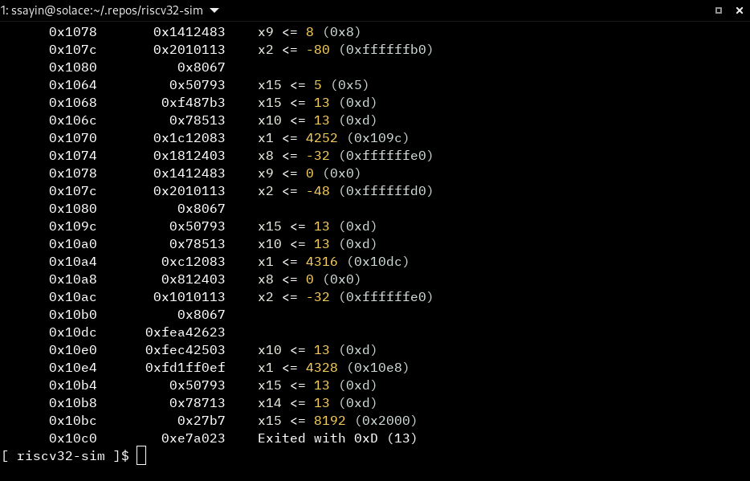

riscv32-sim  
===========

<!--

-->

  

An easy-to-use, still-in-development RISC-V 32-bit simulator.

### Built With

* [ELFIO](https://github.com/serge1/ELFIO) - A header-only C++ library intended for reading and generating files in the ELF binary format.
* [{fmt}](https://github.com/fmtlib/fmt) - An open-source formatting library providing a fast and safe alternative to C stdio and C++ iostreams.
